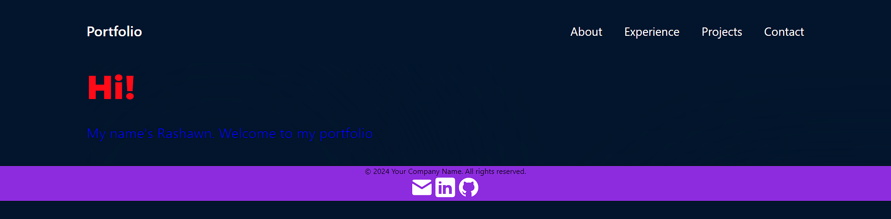
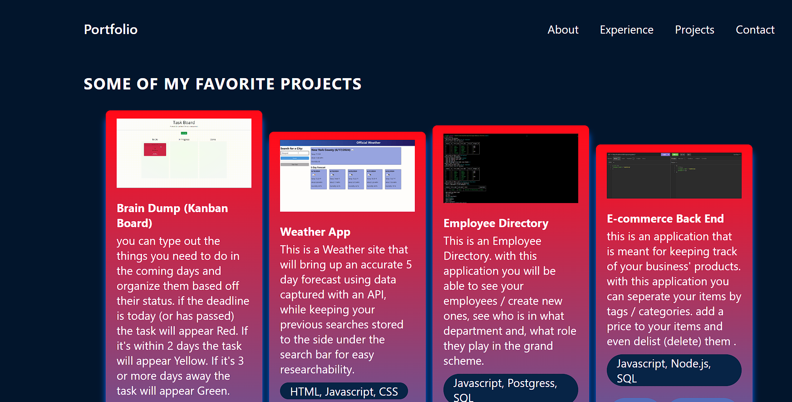

# Portfolio

## Description 
This [Portfolio](https://main--boysfirstfolio.netlify.app/) is a place that holds links to my github repo, ways to contact me, and visuals of alot of my past works for potential employers to take a look at.

## Table of Contents

- [Visuals](#visuals)
- [Usage](#usage)
- [Installation](#installation)
- [Support](#support)
- [Acknowledgements](#acknowledgements)
- [References](#references)
- [License](#license)

## Visuals



## Usage
The proper usage is to showcase things i've worked on and give future employers a way to contact me !

## Installation
If you want to view this project locally just run the following commands in your terminal
- First: to download the required packages execute the following
```
npm run build
```
- Secondly: to actually start the server just execute the following command
```
npm run start
```

## Support
Find me on [Github!](https://github.com/TheR16H) for any support or to see any of my other works.

## Acknowledgements
Special thanks to everyone who helped along the way it would not have been possible without them (even if they don't know it yet). <u><b>I can't name everyone</b></u> but here's a select few! make sure to visit their respective repos as well! 
- [Mr. Jung](https://github.com/juhuyoon) - A <b>phenomenal</b> instructor and motivator. he helped me learn a lot, and without him, it would not have been possible.
- [Samuel](https://github.com/swlodawski) - aided in maintaining concentration and a positive attitude. a wonderful friend throughout the journey. 
- [Micah](https://github.com/Kalink52) - Always willing to assist with problem solving / troubleshooting and is a very diligent worker. the laughter and good times also helped me with regaining focus sometimes. i hope there's more of those moments!


## References
- [Source](https://github.com/TheR16H) 
- [Keyframes](https://developer.mozilla.org/en-US/docs/Web/API/Web_Animations_API/Keyframe_Formats)
- [React Docs](https://react.dev/)
- [Custom Cursor Methods](https://www.freecodecamp.org/news/how-to-make-a-custom-mouse-cursor-with-css-and-javascript/)
- [Netlify Deployment Docs](https://docs.netlify.com/site-deploys/overview/)


## License
MIT License 🔔

Copyright (c) 2024 Rashawn Hall

Permission is hereby granted, free of charge, to any person obtaining a copy
of this software and associated documentation files (the "Software"), to deal
in the Software without restriction, including without limitation the rights
to use, copy, modify, merge, publish, distribute, sublicense, and/or sell
copies of the Software, and to permit persons to whom the Software is
furnished to do so, subject to the following conditions:

The above copyright notice and this permission notice shall be included in all
copies or substantial portions of the Software.

THE SOFTWARE IS PROVIDED "AS IS", WITHOUT WARRANTY OF ANY KIND, EXPRESS OR
IMPLIED, INCLUDING BUT NOT LIMITED TO THE WARRANTIES OF MERCHANTABILITY,
FITNESS FOR A PARTICULAR PURPOSE AND NONINFRINGEMENT. IN NO EVENT SHALL THE
AUTHORS OR COPYRIGHT HOLDERS BE LIABLE FOR ANY CLAIM, DAMAGES OR OTHER
LIABILITY, WHETHER IN AN ACTION OF CONTRACT, TORT OR OTHERWISE, ARISING FROM,
OUT OF OR IN CONNECTION WITH THE SOFTWARE OR THE USE OR OTHER DEALINGS IN THE
SOFTWARE.
